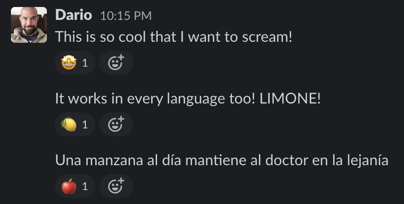
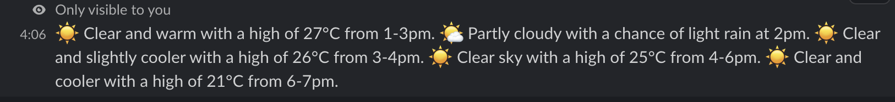

# GPTReactions

## A 🤖 bot that react to messages 💌 appropriately

This is just a fun-project, if you are looking for something useful
you went the wrong way. 😄

This bot is just a POC that humans are superfluous - we all have that
coworker that just react to your messages with an emoji without giving
valuable feedback. That is surely a task that AI can solve 🤣

This bot that listen to all messages - ask OpenAI GPT for an appropriate
Emoji that summarise their text and use that for a reaction. Lovely ❤️

This is an example of the useless interaction that you can simulate



## Installation in a nutshell

Nobody should use it - so, very quickly, this is how to install it:

* Create a SlackBot (there's a `app_manifest.yaml` you can start from)
* Give it (channels:history, chat:write, im:history, reactions:write)
* In Event subscriptions, allow: (`message.channels`, `message.im`,
  `message.group`)
* Enable "Socket Mode"
* Install the app and note down the Slack app token, bot token and signing secrets.
  Together with your OPENAI API key in a .env file.
  Here is an example of how what `.env` file should look like

  ```
  SLACK_APP_TOKEN = xapp-...
  SLACK_BOT_TOKEN = xoxb-...
  SLACK_APP_SIGNING_SECRET = ...
  OPENAI_API_KEY = ...
  ```
* Install the requirements
* Run the `bot.py` ⚡️

## One more thing

### Meteo

Everything counts as a GPT-based reaction to a message,
so this is also a playground for some other feature.
The bot allows you to use a `/meteo` Slack command to get weather forecasts.

Try for example
```
/meteo Marbella tomorrow afternoon
```



GPT doesn't know about weather (or "tomorrow") but it knows places
and time - so here we integrate with OpenMeteo to fill the gaps.
