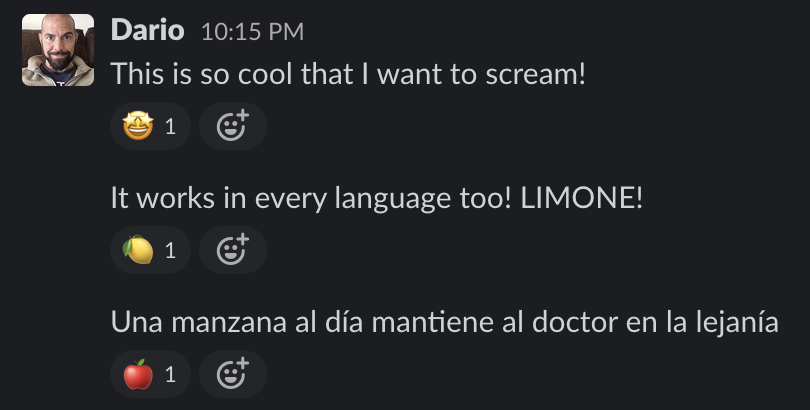

# GPTReactions

## A 🤖 bot that react to messages 💌 appropriately

This is just a fun-project, if you are looking for something useful
you went the wrong way. 😄

This bot is just a POC that humans are superfluous - we all have that
coworker that just react to your messages with an emoji without giving
valuable feedback. That is surely a task that AI can solve 🤣

This bot that listen to all messages - ask OpenAI GPT for an appropriate
Emoji that summarise their text and use that for a reaction. Lovely ❤️

## Installation in a nutshell

Nobody should use it - so, very quickly, this is how to install it:

* Create a SlackBot
* Give it (channels:history, chat:write, im:history, reactions:write)
* Enable "Socket Mode"
* Note down the Slack app token, bot token and signing secret together
  with your OPENAI API key in a .env file.
  Here is an example of how what `.env` file should look like

  ```
  SLACK_APP_TOKEN = xapp-...
  SLACK_BOT_TOKEN = xoxb-...
  SLACK_APP_SIGNING_SECRET = ...
  OPENAI_API_KEY = ...
  ```
* Install the requirements
* Run the `bot.py`

This is an example of the useless interaction that you can simulate
